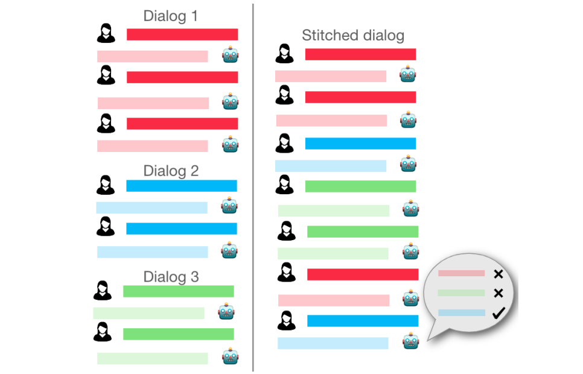

## DialogStitch

This repository contain the code for the paper:

**DialogStitch: Synthetic Deeper and Multi-Context Task-Oriented Dialogs**  
[Satwik Kottur][satwik]\*, [Chinnadhurai Sankar][chinna]\*, [Zhou Yu][zhou], [Alborz Geramifard][alborz]  
[[PDF][pdf]][[Anthology][anthology]][[Code][github]]  
*Special Interest Group on Discourse and Dialogue (SigDIAL), 2021*  
\*=equal contribution


###Abstract

Real-world conversational agents must effectively handle long conversations that span multiple contexts. Such context can be interspersed with chitchat (dialog turns not directly related to the task at hand), and potentially grounded in a multimodal setting. While prior work focused on the above aspects in isolation, there is a lack of a unified framework that studies them together. To overcome this, we propose DialogStitch, a novel framework to seamlessly ‘stitch’ multiple conversations and highlight these desirable traits in a taskoriented dialog. After stitching, our dialogs are provably deeper, contain longer-term dependencies, and span multiple contexts, when compared with the source dialogs—all free of cost without any additional annotations! Though our framework generalizes to a variety of combinations, we demonstrate its benefits in two settings: (a) multimodal, imagegrounded conversations, and, (b) task-oriented dialogs fused with chit-chat conversations. We benchmark state-of-the-art dialog models on our datasets and find accuracy drops of (a) 12% and (b) 45% respectively, indicating the additional challenges in the stitched dialogs.



If you find this code useful, consider citing our work:

```
@inproceedings{kottur-etal-2021-dialogstitch,
    title = "{D}ialog{S}titch: Synthetic Deeper and Multi-Context Task-Oriented Dialogs",
    author = "Kottur, Satwik  and
      Sankar, Chinnadhurai  and
      Yu, Zhou  and
      Geramifard, Alborz",
    booktitle = "Proceedings of the 22nd Annual Meeting of the Special Interest Group on Discourse and Dialogue",
    month = jul,
    year = "2021",
    address = "Singapore and Online",
    publisher = "Association for Computational Linguistics",
    url = "https://aclanthology.org/2021.sigdial-1.3",
    pages = "21--26",
}
```

### Code and Datasets
Please see `clevr_dialog/` for dataset and code setup for experiments on the multimodal dialog dataset.


###License
This project is licensed under the license found in the LICENSE file in the root directory of this source tree ([here][license]).


[satwik]:https://satwikkottur.github.io/
[chinna]:https://chinnadhurai.github.io/
[zhou]:http://www.cs.columbia.edu/~zhouyu/
[alborz]:http://alborz-geramifard.com/Homepage/Welcome.html
[pdf]:https://aclanthology.org/2021.sigdial-1.3.pdf
[anthology]:https://aclanthology.org/2021.sigdial-1.3/
[github]:https://github.com/facebookresearch/DialogStitch
[license]:./LICENSE